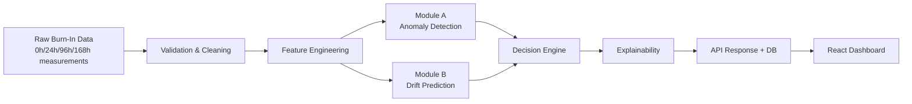

# ⚡ BurnSight AI — Component Burn-In Anomaly Detection

> **SIH 2026 Project** — AI-driven anomaly detection in electronic component burn-in & environmental stress screening.
> Catches latent defects that traditional static-limit screening misses.

---

## 🎯 What This System Does

Traditional burn-in screening only checks whether a measurement exceeds a hard spec limit at 168h. This **misses latent defects** — components that pass the spec limit but drift anomalously relative to their lot population, and are likely to fail in the field.

**BurnSight AI** adds two dynamic AI modules on top of static screening:

| Method | Latent Defects Caught | False Negatives | Escaped Defects | Detection Rate |
|--------|-----------------------|-----------------|-----------------|----------------|
| Static Only (traditional) | **0 / 36** | 98 | 98 | 18.3% |
| Static + Module A (AI anomaly) | **36 / 36** | 24 | 24 | 80.0% |
| **Full System (A + B)** | **36 / 36** | **15** | **15** | **87.5%** |

*All numbers computed on the held-out test set (n=167 components) from the actual trained pipeline.*

---

## 🏗️ Architecture



### Module A — Dynamic Anomaly Detection

- **MAD z-score**: Computes each component's deviation from its lot-level median using Median Absolute Deviation (robust, not sensitive to outliers)
- **Isolation Forest**: Ensemble of 100 random isolation trees fitted per lot; detects multivariate anomalies not caught by univariate z-score
- **Fusion**: Weighted combination (MAD: 55%, IF: 45%) → single anomaly score ∈ [0, 1]
- **Severity bands**: LOW (<0.40), MEDIUM (0.40–0.65), HIGH (>0.65)

**Test set results (n=501 records):**

| Metric | Value |
|--------|-------|
| Precision | 0.652 |
| Recall | 0.750 |
| F1 Score | 0.698 |
| False Negative Rate | 0.250 |
| ROC-AUC | **0.827** |
| PR-AUC | 0.580 |

### Module B — Drift Prediction

- Uses only 0h, 24h, 96h measurements + engineered features as inputs (**no data leakage** — 168h is the prediction target)
- Trains 3 candidate models per parameter via 5-fold cross-validation and selects the best by MAE
- **Anti-leakage guarantee**: `assert_no_leakage()` runs at feature engineering time and raises on any 168h-derived input

**Candidate models and winner:**

| Parameter | Linear Reg MAE | Ridge MAE | **Random Forest MAE** | Winner |
|-----------|---------------|-----------|----------------------|--------|
| iddq | 0.311 | 0.370 | **0.245** | 🏆 RF |
| leakage_current | 3.728 | 3.502 | **3.183** | 🏆 RF |
| propagation_delay | 0.980 | 0.924 | **0.708** | 🏆 RF |

**Test set performance:**

| Parameter | MAE | RMSE | R² |
|-----------|-----|------|----|
| iddq | 0.231 mA | 0.513 mA | 0.692 |
| leakage_current | 2.959 µA | 5.783 µA | 0.733 |
| propagation_delay | 0.606 ns | 1.271 ns | 0.756 |

### Safety Slope

The **safety slope** is the maximum tolerable drift rate (per hour) derived from the worst-case healthy component in the training set — the component closest to the spec limit that was still classified healthy:

```
safety_slope(param) = (spec_limit - worst_healthy_96h) / (168 - 24)
```

This converts drift rate into a physical risk metric — a component drifting at >100% of safety slope is classified DANGEROUS.

### Decision Engine

Decisions are made by a YAML-configured priority-ordered rule table:

| Static | Anomaly Severity | Drift Risk | Decision |
|--------|-----------------|------------|----------|
| FAIL | any | any | **REJECT** |
| PASS | HIGH | DANGEROUS | **REJECT** |
| PASS | HIGH | WATCH | **REVIEW** |
| PASS | MEDIUM | DANGEROUS | **REVIEW** |
| PASS | LOW/MEDIUM | WATCH | **WATCH** |
| PASS | LOW | SAFE | **PASS** |

---

## 🚀 Quick Start (Local)

### Prerequisites
- Python 3.10+
- Node.js 20+

### Backend
```bash
cd backend
python -m venv venv
venv\Scripts\activate        # Windows
# or: source venv/bin/activate  # Linux/Mac
pip install -r requirements.txt
```

### Run Everything (from repo root)
```bash
python run.py
```

This automatically:
1. Generates synthetic dataset (2,688 rows, 895 components)
2. Trains Module A + Module B
3. Computes safety slopes
4. Screens full dataset + demo components
5. Runs evaluation and baseline comparison
6. Starts FastAPI at **http://localhost:8000**

### Start Frontend (separate terminal)
```bash
cd frontend
npm install
npm run dev
```
→ Dashboard at **http://localhost:5173**

### Options
```
python run.py --pipeline-only    # Train and evaluate, skip API server
python run.py --skip-generate    # Reuse existing data
python run.py --api-only         # Start API only (after pipeline run)
```

---

## 🐳 Docker (Full Stack)

```bash
docker-compose up --build
```

- **Frontend**: http://localhost:80
- **Backend API**: http://localhost:8000
- **API docs**: http://localhost:8000/docs

> On first run, the backend container automatically generates data and trains models before starting the API.

---

## 🌐 API Reference

| Method | Endpoint | Description |
|--------|----------|-------------|
| GET | `/health` | Health check + version |
| GET | `/dashboard-stats` | Aggregate decision counts, anomaly rate |
| GET | `/metrics` | Full evaluation report (Module A, B, baseline) |
| GET | `/screening-results` | All screened records (paginated) |
| GET | `/component/{id}` | Full detail for one component |
| GET | `/lot/{id}` | Lot-level stats and anomalous component list |
| POST | `/predict` | Score new measurements (A + B + decision) |
| POST | `/anomaly` | Module A only |
| POST | `/drift` | Module B only |
| POST | `/screen` | Batch screen + persist to DB |

**Example `/predict` request:**
```json
{
  "measurements": [
    {
      "component_id": "NEW-001",
      "lot_id": "LOT-XYZ",
      "parameter": "leakage_current",
      "value_0h": 10.5,
      "value_24h": 18.2,
      "value_96h": 32.0,
      "value_168h": 45.1,
      "spec_min": 0.0,
      "spec_max": 50.0
    }
  ]
}
```

Full interactive docs: http://localhost:8000/docs

---

## 📊 Dashboard Pages

| Page | What It Shows |
|------|--------------|
| **Dashboard** | Hero stats, decision distribution, baseline comparison, Module A metrics |
| **Component Explorer** | Per-component trajectory chart + anomaly + drift + explanation |
| **Lot Analysis** | Lot-level stats, anomaly score histogram, flagged components list |
| **Screening Results** | Sortable/filterable full results table with all records |
| **Baseline Comparison** | Static vs AI head-to-head comparison with full model selection table |

---

## 🎬 C003 Demo Story

Component **C003** is the headline demonstration of why AI screening matters:

- **Parameter**: `leakage_current`
- **Measurements**: 0h=10.5 µA → 24h=18.2 µA → 96h=32.0 µA → 168h=45.1 µA
- **Spec Max**: 50.0 µA → **Static result: PASS** ✅
- **Lot median**: ~10.2 µA, MAD=0.8 µA
- **Module A robust z-score**: >> 3.5 → **Severity: HIGH** 🔴
- **Module B prediction**: DANGEROUS drift trajectory
- **Final decision**: **REJECT / REVIEW** ❌

Static screening would have shipped this component. BurnSight AI flags it.

To see this in the dashboard: **Component Explorer** → search `C003`

---

## 🧪 Tests

```bash
cd backend
venv\Scripts\python -m pytest tests/ -v
```

Test coverage:
- `test_validation.py` — schema validation, invalid row detection, imputation
- `test_features.py` — anti-leakage (CRITICAL), lot stats, feature correctness
- `test_module_a.py` — latent defect detection, score bounds, save/load
- `test_module_b.py` — drift prediction, model selection, anti-leakage, save/load
- `test_decision.py` — all 4 outcomes reachable, C003 headline case
- `test_api.py` — smoke tests for all 10 endpoints

---

## 📂 Project Structure

```
2026-SIH/
├── run.py                          # One-shot pipeline + API runner
├── docker-compose.yml              # Full-stack Docker composition
├── backend/
│   ├── Dockerfile
│   ├── requirements.txt
│   ├── configs/
│   │   ├── config.yaml             # Central configuration
│   │   └── decision_rules.yaml     # Editable decision logic (YAML)
│   ├── app/
│   │   ├── main.py                 # FastAPI app entrypoint
│   │   ├── api/
│   │   │   ├── routes.py           # All API routes
│   │   │   └── schemas.py          # Pydantic request/response models
│   │   ├── core/config.py          # Config loader
│   │   ├── data/
│   │   │   ├── generator.py        # Synthetic data generator
│   │   │   └── database.py         # SQLAlchemy ORM + SQLite
│   │   ├── preprocessing/
│   │   │   ├── validation.py       # Schema validation, invalid row detection
│   │   │   ├── cleaning.py         # Deduplication, imputation
│   │   │   └── features.py         # Feature engineering (anti-leakage enforced)
│   │   ├── models_ml/
│   │   │   ├── module_a_anomaly.py # MAD + Isolation Forest anomaly detection
│   │   │   ├── module_b_drift.py   # Regressor drift prediction + model selection
│   │   │   └── safety_slope.py     # Safety slope calculation
│   │   ├── decision/
│   │   │   └── engine.py           # Rule-based decision engine
│   │   ├── explain/
│   │   │   └── explain.py          # Human-readable explanation generator
│   │   └── services/
│   │       └── pipeline.py         # ScreeningPipeline orchestrator
│   ├── scripts/
│   │   ├── run_pipeline.py         # Main training script
│   │   ├── generate_data.py        # Data generation script
│   │   ├── evaluate.py             # Evaluation script
│   │   └── compare_baselines.py    # Baseline comparison script
│   ├── tests/                      # pytest test suite
│   ├── models/                     # Saved model artifacts
│   └── data/                       # Datasets and evaluation reports
└── frontend/
    ├── Dockerfile
    ├── src/
    │   ├── api/client.ts           # Typed API client
    │   ├── pages/
    │   │   ├── Dashboard.tsx
    │   │   ├── ComponentExplorer.tsx
    │   │   ├── LotAnalysis.tsx
    │   │   ├── ScreeningResults.tsx
    │   │   └── BaselineComparison.tsx
    │   ├── App.tsx                 # Root + navigation
    │   └── index.css               # Design system (dark mode, glassmorphism)
    └── index.html
```

---

## ⚙️ Configuration

All parameters are in `backend/configs/config.yaml`. Key settings:

```yaml
module_a:
  mad_z_threshold: 3.5
  isolation_forest_contamination: 0.1
  score_weights:
    mad: 0.55
    isolation_forest: 0.45
  anomaly_threshold: 0.65

module_b:
  candidate_models: [linear_regression, ridge, random_forest]
  cv_folds: 5
```

The decision logic is fully editable in `backend/configs/decision_rules.yaml` — no code changes required to adjust PASS/WATCH/REVIEW/REJECT thresholds.

---

## ⚠️ Known Limitations

1. **Dataset size**: The synthetic dataset uses ~900 components; real burn-in facilities may have 10x–100x more. Module B's Random Forest should scale well; Module A's lot-level Isolation Forest would need cluster-based training for very large lots.
2. **Single database**: SQLite is sufficient for the prototype. For production, migrate to PostgreSQL.
3. **No authentication**: The API has no authentication layer — add OAuth2/JWT before production deployment.
4. **Synthetic data**: The generator models realistic failure modes but is not calibrated to a specific device type. Real deployment requires re-training on actual burn-in data.
5. **Lot-level cold start**: Module A requires at least ~10 components per lot to fit a meaningful Isolation Forest; falls back to global model otherwise.

---

## 📜 License

MIT License — SIH 2026 Submission